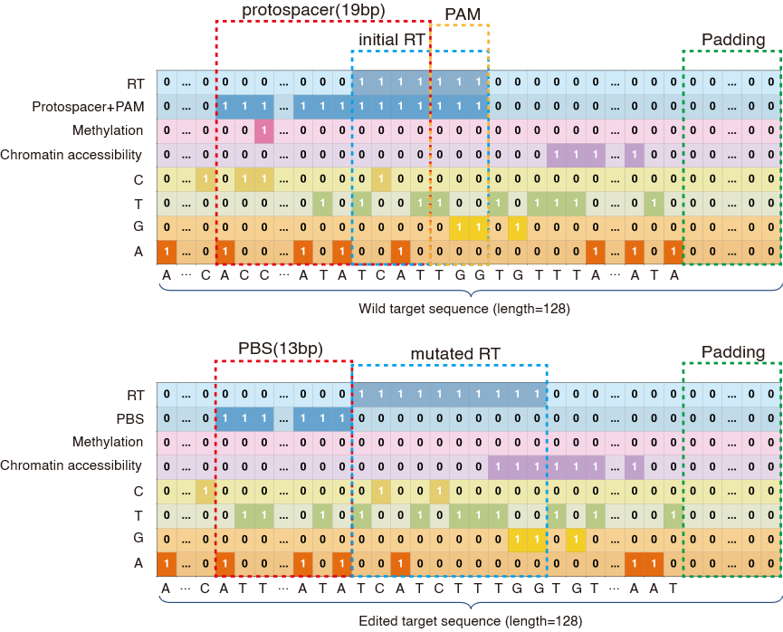

# PrimeNet: A Deep Learning Model for Prime Editing Efficiency Prediction

## Introduction
PrimeNet is a deep learning model designed to predict Prime editing efficiency with high accuracy by integrating epigenetic factors such as chromatin accessibility and DNA methylation. Unlike existing models, PrimeNet leverages multi-scale convolution and attention mechanisms to extract diverse sequence features, achieving superior generalization across different conditions. Our results show that PrimeNet achieves a Spearman correlation coefficient of 0.94, outperforming existing models.

## Model input
- **Sequence**: Wild Sequence and the Edited Sequence.
- **Epigenetic information**: chromatin accessibility and DNA methylation status. For chromatin accessibility features, a site is labeled "Y" if it is chromatin accessible and "N" otherwise. For methylation features, a site is labeled as "Y" if it is methylated and "N" if it is unmethylated.
- **Functional area information**: The positions of Protospacer, PAM, PBS, and RT in the sequence.
### Data Encoding  
We encode the input data as an image for deep learning processing:  



## Model output
- **valid editing efficiency**: The proportion of sequences that are successfully edited as intended, meaning the desired genetic modification is correctly introduced.
- **unedited efficiency**: The proportion of sequences that remain unchanged, indicating that Prime editing did not occur.
- **erroneous editing efficiency**: The proportion of sequences that were edited incorrectly, meaning unintended modifications occurred instead of the expected edit.

## Installation

### 1. Clone the Repository  
```bash
# Clone the repository
git clone https://github.com/bm2-lab/PrimeNet.git
cd PrimeNet
```
### 2. Install Dependencies
```bash
# Ensure you have Python 3.8+ installed, then run:
pip install numpy pandas torch scikit-learn scipy
```

## File Descriptions

- **PrimeNet.pth**: The trained model weights file.  
- **model.py**: Defines the PrimeNet architecture and forward pass.  
- **train_val.py**: Training and validation script for PrimeNet.  
- **test.py**: Inference script for loading a trained model and evaluating on held-out data.  
- **data/**: Raw and processed datasets used for training and testing.  

### Retrained Model Results

- **DeepPE/**: Retrained DeepPE model and data.  
- **PRIDICT/**: Retrained PRIDICT model and data.  
- **deepprime/**: Retrained deepprime model and data.  

## Model Distillation and Student Models

In addition to the full‐size PrimeNet teacher model, we are implementing a **model distillation** workflow to produce lightweight “student” networks with varying parameter counts. These distilled models are optimized to run efficiently on CPU while retaining high accuracy. 

## License
This project is licensed under the Apache License. See [LICENSE](LICENSE) for details.

## Contact
For questions or collaborations, please contact 2251917@tongji.edu.cn or open an issue on GitHub.